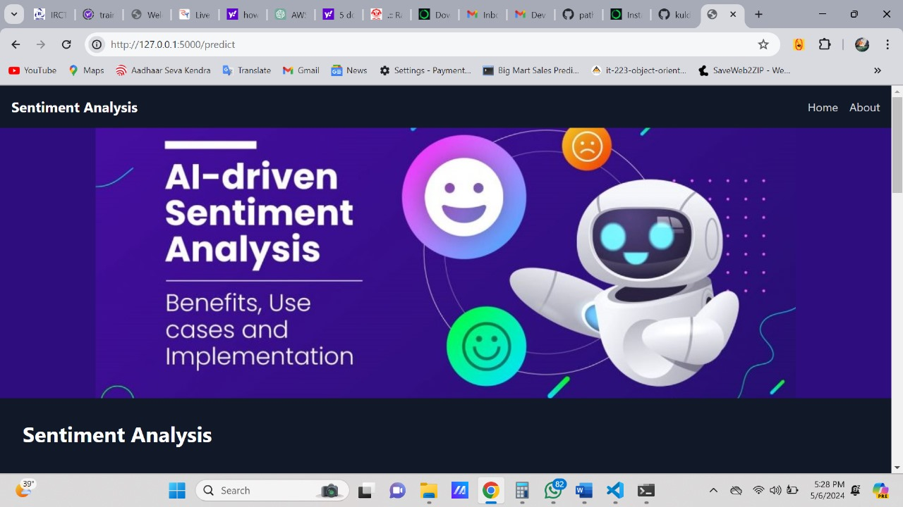
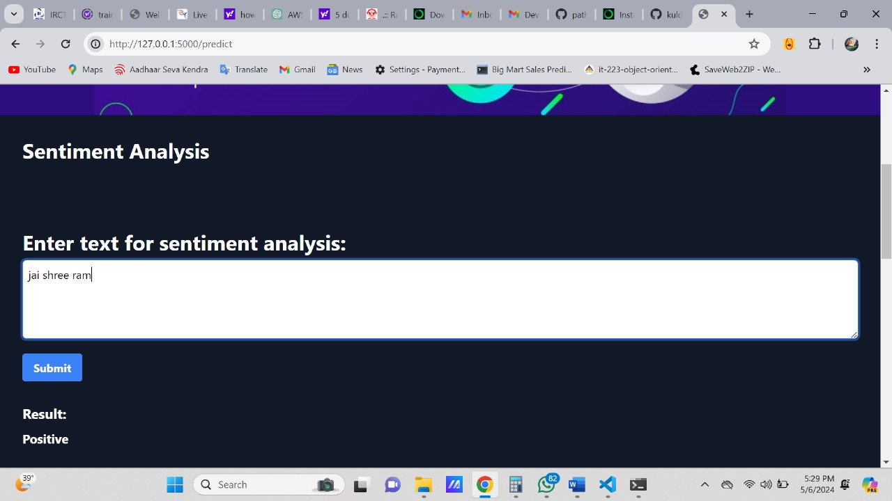
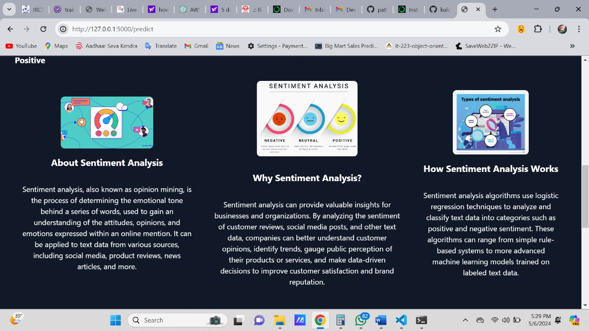

## twitter-sentiment-analysis
Description
The Twitter Sentiment Analysis project aims to analyze the sentiment of text input from Twitter data, classifying it as either positive or negative. The project utilizes machine learning techniques to process and analyze text data, providing insights into the sentiment expressed in tweets.

# Project Overview
# Data Collection
The project initially involved collecting Twitter data from Kaggle, a popular platform for datasets. The dataset consists of tweets labeled with their sentiment (positive or negative), providing a labeled corpus for training and testing the sentiment analysis model.

# Preprocessing and Feature Extraction
The collected Twitter data underwent preprocessing steps to clean and prepare it for analysis. This included removing stopwords (common words that do not carry significant meaning), stemming (reducing words to their root form), and vectorizing the text data using TF-IDF (Term Frequency-Inverse Document Frequency) vectorization. These steps helped to transform the raw text data into numerical features suitable for machine learning algorithms.

# Model Training and Evaluation
The preprocessed data was split into training and testing sets using the train_test_split function from scikit-learn. A logistic regression model was trained on the training data, utilizing the TF-IDF vectors as input features and the sentiment labels as target variables. The model's performance was evaluated using accuracy_score, which measures the accuracy of the model's predictions compared to the actual sentiment labels.

# Model Deployment
The trained sentiment analysis model was deployed using the Flask web framework, allowing users to input text and receive predictions of sentiment (positive or negative) based on the trained model. The Flask application provides a user-friendly interface for interacting with the sentiment analysis functionality, making it accessible to users.

# Technologies Used
Python: Programming language used for data preprocessing, model training, and Flask application development.
NLTK (Natural Language Toolkit): Python library used for text preprocessing tasks such as stopwords removal and stemming.
scikit-learn: Python library used for machine learning tasks such as model training, evaluation, and feature extraction.
Flask: Web framework used for deploying the sentiment analysis model and creating the user interface.
HTML/CSS: Markup and styling languages used for designing the user interface of the Flask application.
Screenshots

# Description of the screenshot



# Description of the screenshot


# Description of the screenshot



# Future Enhancements
Expand the dataset to improve the model's performance on a wider range of tweets and topics.
Implement more advanced natural language processing techniques, such as word embeddings, to capture richer semantic information in the text data.
Enhance the user interface of the Flask application to improve user experience and accessibility.
# Conclusion
The Twitter Sentiment Analysis project demonstrates the application of machine learning techniques to analyze sentiment in text data from social media platforms such as Twitter. By preprocessing the data, training a sentiment analysis model, and deploying it in a Flask application, the project provides a practical solution for analyzing sentiment in real-world text data.


 1. **Clone the repository:**
   ```bash
   git clone https://github.com/kuldeepkd0603/twitter-sentiment-analysis.git
   cd twitter-sentiment-analysis
   pip install -r requirements.txt
   python app.py

